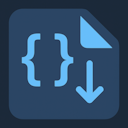

# Better Regions

More control over region blocks across multiple languages. Automatically folds marker regions like `#region`/`#endregion` (or their language equivalents) when a file is opened, with sensible exceptions.

## What it does

- On first open of a file, folds all marker regions in that editor.
- If you navigate to a specific line (e.g. via Find, Go to Definition, Go to Line), the extension avoids folding the region that contains your target line. If it can detect all region ranges, it folds the other regions and leaves your target region expanded. If it cannot detect ranges, it skips folding entirely for that navigation.
- Remembers which files are currently open. If a file remains open in another tab, switching back will not refold it. Only once that document is fully closed and re-opened will auto-folding run again.

### Examples
1. Open a file -> regions fold -> expand a region to inspect it -> switch to another file -> switch back -> your expanded region remains open. The extension does not re-fold because the document was never closed.
2. Open file A -> regions fold -> expand a region -> open file B -> close file A -> re-open file A -> regions fold again (fresh open).
3. Use “Go to Definition” to jump into a symbol located inside a region -> that containing region stays open; other regions get folded when possible.

## Settings

All settings live under the `betterRegions` namespace.

- betterRegions.enableForAllFiles (boolean, default: true)
	- Run Better Regions for all files, except those listed in `disabledFiles`.
- betterRegions.enabledFiles (string[])
	- Language IDs to enable when `enableForAllFiles` is false. Example: ["typescript", "javascript", "python"].
- betterRegions.disabledFiles (string[])
	- Language IDs to exclude when `enableForAllFiles` is true. Example: ["markdown", "plaintext"].

Notes:
- Language ID is the VS Code language identifier (e.g. `typescript`, `javascript`, `csharp`, `python`, `cpp`, `java`, `markdown`).
- `enableForAllFiles: true` + `disabledFiles: ["markdown"]` means fold everywhere except Markdown.
- `enableForAllFiles: false` + `enabledFiles: ["typescript"]` means only fold in TypeScript files.

## How it works (high level)

- The extension listens when an editor becomes active and when documents close.
- It tracks which URIs are currently open; auto-folding only runs the first time a document appears after being closed.
- Folding is performed using built-in commands:
	- `editor.foldAllMarkerRegions` for the default behavior.
	- For targeted navigation, it queries folding ranges via `vscode.executeFoldingRangeProvider` and folds all marker regions except the one containing the caret.

## Troubleshooting

- Nothing folds when opening a file:
	- Ensure the language ID isn’t excluded by your settings.
	- For special navigation into a line, the extension may skip folding to keep your target visible.
- Regions don’t fold for a particular language:
	- Some languages may not provide folding ranges for marker regions. The extension relies on VS Code’s folding support.

**Enjoy!**
