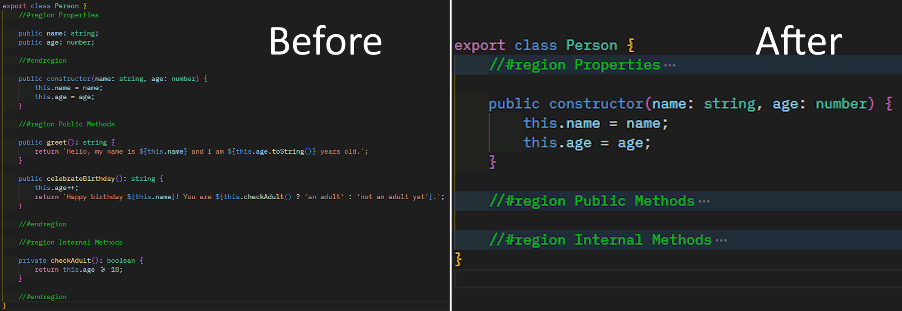

# Better Regions

> More control over region blocks across multiple languages. Automatically folds marker regions like `#region`/`#endregion` (or their language equivalents) when a file is opened, with sensible exceptions.

## What it does

- On first open of a file, folds all marker regions in that editor.
- If you navigate to a specific line (e.g. via Find, Go to Definition, Go to Line), the extension avoids folding the region that contains your target line. If it can detect all region ranges, it folds the other regions and leaves your target region expanded. If it cannot detect ranges, it skips folding entirely for that navigation.
- Remembers which files are currently open. If a file remains open in another tab, switching back will not refold it. Only once that document is fully closed and re-opened will auto-folding run again.

> **Suggestions are welcome!** Please create an issue on the GitHub repo and your suggestion will be taken into consideration!

# Index
* [What it does](#what-it-does)
* [Settings](#settings)
	* [Notes](#notes)
* [Output channel](#output-channel)
* [How it works](#how-it-works)
	* [Examples](#examples)
* [Troubleshooting](#troubleshooting)
* [References](#references)
* [Release Notes](#release-notes)

## Settings

While this extension will work straight out the box, there are some settings that live under the `betterRegions` namespace, which will allow you to tailor the extension to your needs.

- `betterRegions.enableForAllFiles` (boolean, default: **true**)
	- Run Better Regions for all files, except those listed in `disabledFiles`.
- `betterRegions.enabledFiles` (string[])
	- Language IDs to enable when `enableForAllFiles` is **false**. Example: `["typescript", "javascript", "python"]`.
- `betterRegions.disabledFiles` (string[])
	- Language IDs to exclude when `enableForAllFiles` is **true**. Example: `["markdown", "plaintext"]`.

### Notes:

- Language ID is the VS Code language identifier (e.g. `typescript`, `javascript`, ...).
- `enableForAllFiles: true` + `disabledFiles: ["markdown"]` means fold everywhere *except* Markdown.
- `enableForAllFiles: false` + `enabledFiles: ["typescript"]` means only fold in TypeScript files.

## Output channel

The extension writes detailed logs to the "Better Regions" output channel (View -> Output -> Better Regions) so you can see what files are being folded. If there are any errors with the extension then they will be displayed here.

## How it works

- The extension listens when an editor becomes active and when documents close.
- It tracks which URIs are currently open; auto-folding only runs the first time a document appears after being closed.
- Folding is performed using built-in commands:
	- `editor.foldAllMarkerRegions` for the default behavior.
	- For targeted navigation, it queries folding ranges via `vscode.executeFoldingRangeProvider` and folds all marker regions except the one containing the caret.

### Examples

1. Open a file -> regions fold -> expand a region to inspect it -> switch to another file -> switch back -> your expanded region remains open. The extension does not re-fold because the document was never closed.
2. Open file A -> regions fold -> expand a region -> open file B -> close file A -> re-open file A -> regions fold again (fresh open).
3. Use “Go to Definition” to jump into a symbol located inside a region -> that containing region stays open; other regions get folded when possible.

## Troubleshooting

- Nothing folds when opening a file:
	- Ensure the language ID isn’t excluded by your settings.
	- For special navigation into a line, the extension may skip folding to keep your target visible.
- Regions don’t fold for a particular language:
	- Some languages may not provide folding ranges for marker regions. The extension relies on VS Code’s folding support.

> Please report any bugs to the GitHub issues page for them to be triaged and fixed.

## References

- [VS Code Language Identifiers](https://code.visualstudio.com/docs/languages/identifiers): See this page for a list of available languages.

## Release Notes

> Please see the changelog for release notes.
[Changelog](CHANGELOG.md)

## License

See [LICENSE](LICENSE).
